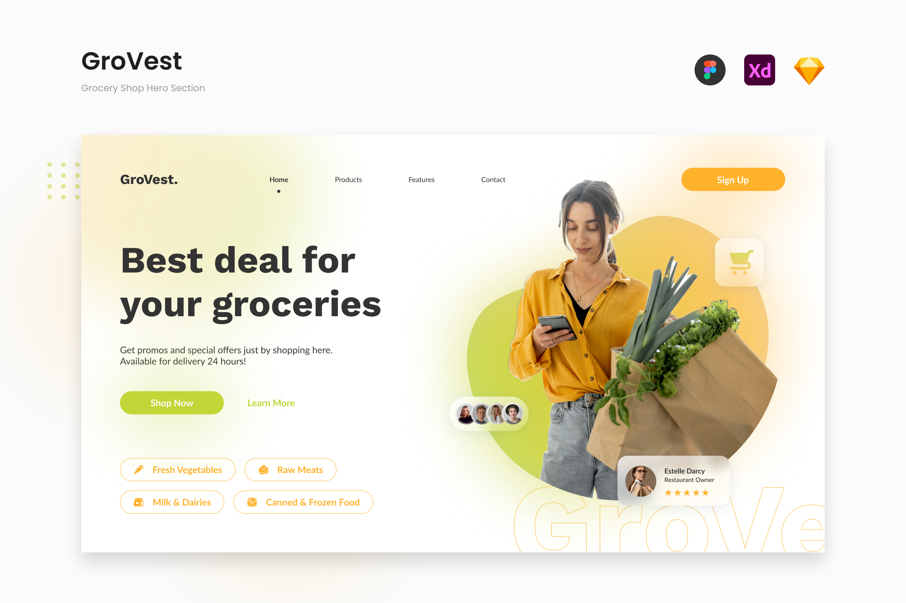
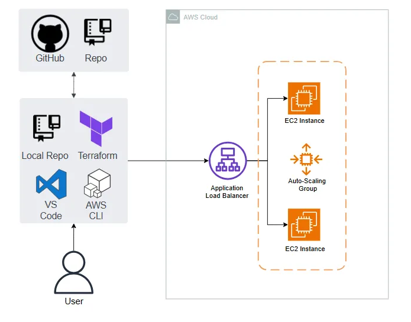

# Build a Live Website Using Terraform

## Overview

This Terraform project creates a simple website provisioned entirely by Terraform. The architecture and website sample are shown below. The purpose of this project is to learn fundamendal terraform concepts by building a fairly straigthforward, but highly practical, hands-on project.

In this project we provision a sample furniture store website hosted on an AWS EC2 instance behind an Application Load Balancer (ALB), managed by an Auto Scaling Group (ASG). The ASG ensures that a minimum of 2 instances are always running, scaling up to 4 instances based on load.
I tried to provision something more sophisticated than a blank "Hello World" page as I find it quite trivial and quite honestly, a bit boring. 

You can follow the information and intructions below to duplicate this project, and learn key Terraform concepts yourself. Happy learning!

## The Architecture


## **Prerequisites**
Before deploying this project, ensure you have the following installed:

### **1. Install Terraform**
- Download Terraform from the official site: [Terraform Download](https://www.terraform.io/downloads)
- Install it by following the instructions for your OS.
- Verify installation by running:
  ```sh
  terraform -version
  ```

### **2. Configure AWS CLI**
- Install AWS CLI: [AWS CLI Installation](https://aws.amazon.com/cli/)
- Configure it with your AWS credentials:
  ```sh
  aws configure
  ```
  Provide your AWS **Access Key**, **Secret Key**, **Region**, and **Output Format**.

### **3. Set Up VS Code (Optional, but Recommended)**
- Install **VS Code**: [Download Here](https://code.visualstudio.com/)
- Install **Terraform Extension**: Search for `HashiCorp Terraform` in VS Code Extensions.

---

## **Project Structure**
```
terraform-concepts-proj1/
│── main.tf                # Main Terraform configuration file
│── variables.tf           # Variables for Terraform
│── autoscaling.tf         # Auto Scaling group & Policies
│── EC2.tf                 # EC2 instance configuration file
│── ALB.tf                 # Applicatin Load Barancer configuration file
│── SG.tf                  # Security group
│── VPC.tf                 # VPC instance configuration file
│── outputs.tf             # Output values
│── README.md              # Documentation
```

---

## **Deployment Guide**

### **Step 1: Clone the Repository**
```sh
git clone https://github.com/shefreddy/terraform--proj1.git
cd terraform--proj1
```

### **Step 2: Initialize Terraform**
```sh
terraform init
```
- Downloads necessary provider plugins.
- Sets up Terraform backend.

### **Step 3: Plan Deployment**
```sh
terraform plan
```
- Shows what Terraform will create before applying changes.

### **Step 4: Apply Configuration**
```sh
terraform apply -auto-approve
```
- Provisions AWS resources automatically.

### **Step 5: Access the Application**
- After deployment, Terraform outputs the ALB DNS name.
- Open a browser and navigate to:
  ```
  http://<ALB_DNS_NAME>
  ```

### **Step 6: Destroy Resources (Optional)**
If you want to delete all resources:
```sh
terraform destroy -auto-approve
```

---

## **Outputs**
Terraform will output the **ALB DNS Name**, which you can use to access the website:
```sh
alb_dns_name = "your-load-balancer-dns.amazonaws.com"
```

---

## **Resources Created by Terraform**
- **EC2 Instances** (Provisioned by ASG)
- **Application Load Balancer (ALB)**
- **Auto Scaling Group (ASG)**
- **Launch Template**
- **Target Group** (for routing traffic)
- **Security Groups** (for ALB and EC2 instances)

---

## **Terraform Concepts Covered in This Project**
1. **Declarative vs Procedural Infrastructure**
2. **State File (`terraform.tfstate`)**
3. **Terraform Folder (`.terraform`)**
4. **Lock File (`terraform.lock.hcl`)**
5. **Main File (`main.tf`)**
6. **Terraform Init (`terraform init`)**
7. **Terraform Plan (`terraform plan`)**
8. **Terraform Apply (`terraform apply`)**
9. **Resources in Terraform**
10. **Variables in Terraform**
11. **Terraform Destroy (`terraform destroy`)**
12. **Terraform Output Functionality**

This project is an excellent way to learn Terraform in a real-world AWS environment!

---

## **Next Steps**
- Enhance the project by adding HTTPS support with an ACM certificate.
- Use Terraform modules to separate networking and compute resources.
- Implement Terraform remote state management using AWS S3 and DynamoDB.

### **Author: Freddy Shema**

**📌 GitHub Profile:** [Freddy Shema](https://github.com/shefreddy)

